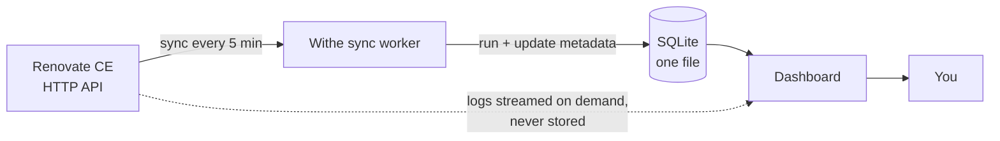

<p align="center">
  <picture>
    <source media="(prefers-color-scheme: dark)" srcset="assets/logo/logo-full-dark.svg">
    
  </picture>
</p>

<p align="center">
  <a href="https://github.com/schubydoo/withe/actions/workflows/ci.yml"></a>
  <a href="https://codecov.io/github/schubydoo/withe"></a>
  
</p>

# One page for the Renovate you already run

Withe reads a Renovate installation that already works and puts the whole fleet on one page — what is
failing, what is waiting to merge, and what is queued next. It observes. It changes nothing.

[**Install →**](#install) · [What it shows](#what-it-shows) · [What it is not](#what-it-is-not)

## The problem

Renovate works across every repository, but you see what it did one repository at a time — in each
repo's Dependency Dashboard issue and in the logs. Across a fleet that does not scale: a run that
failed three days ago on one of forty repos looks exactly like one that never happened, and the
updates waiting to merge or still queued are spread across forty dashboards. Withe puts all of it on
one page.

## How it works



Withe polls Renovate CE's documented API, stores only metadata in one SQLite file, and streams log
content from Renovate on demand. No log scraping, no writes back to Renovate.

## What it shows

The landing page is your whole fleet on one screen, ordered the way you act on it:

| Section | What you get |
|---|---|
| **Failing repositories** | Repos with failing runs, oldest failure first, the error attached |
| **Held for your review** | Updates Renovate is holding for you to act on |
| **Open pull requests** | Updates with a live PR, linked to your forge — what is waiting to merge |
| **Queued, no PR yet** | Updates coming that Renovate has not opened a pull request for |

Plus, per source and per repository:

| View | What you get |
|---|---|
| **Preflight** | The exact env vars Renovate CE is missing, as a block to paste into your Compose file |
| **Repository inventory** | Every org and repo Renovate knows, with enablement, install status, and last run |
| **Run history** | Every run for a repo — queued, started, duration, outcome |
| **Log viewer** | The full JSON-Lines log for any run, via Renovate's documented log endpoint |


## What it is not

Every row is a permanent exclusion, not a roadmap item. Withe is read-only against Renovate by design.

| Withe does NOT | Meaning |
|---|---|
| Run Renovate | It observes one already running; with no Renovate it shows nothing |
| Schedule or trigger runs | Renovate CE offers an endpoint for it; Withe does not call it |
| Write Renovate config | Your `renovate.json` is never touched, and you add nothing to it |
| Merge pull requests | It shows which are open; merging stays on your forge |
| Manage users or roles | One operator viewing their own install; optional HTTP basic auth is the whole of it |

## Install

One container, one volume, one published port. The image is published to GHCR:

```bash
docker pull ghcr.io/schubydoo/withe:latest
```

<details>
<summary><b>Build from source instead</b></summary>

```bash
docker build -t withe .
```

Then use `withe` wherever the commands below say `ghcr.io/schubydoo/withe:latest`.

</details>

Run it (loopback only — see [Exposure](#exposure)):

```bash
docker run -d --name withe --restart unless-stopped \
  --read-only --tmpfs /tmp --tmpfs /app/.next/cache \
  -p 127.0.0.1:8080:3000 -v withe-data:/data \
  -e WITHE_CE_URL=https://renovate.example.lan \
  -e WITHE_CE_TOKEN=your-server-secret \
  ghcr.io/schubydoo/withe:latest
```

Open `http://127.0.0.1:8080`. If Renovate's API is off, the preflight page names the exact variables
to set on the Renovate side.

<details>
<summary><b>Docker Compose</b></summary>

```yaml
services:
  withe:
    image: ghcr.io/schubydoo/withe:latest   # or build: . from this repository
    container_name: withe
    restart: unless-stopped
    read_only: true
    tmpfs:
      - /tmp
      - /app/.next/cache
    ports:
      - "127.0.0.1:8080:3000"   # host loopback only — see Exposure
    volumes:
      - withe-data:/data
    environment:
      WITHE_CE_URL: https://renovate.example.lan
      WITHE_CE_TOKEN: ${WITHE_CE_TOKEN}   # from a .env file or your secret store
      # WITHE_AUTH_USER and WITHE_AUTH_PASS to require a login — see Exposure
      # WITHE_RETENTION_DAYS to cap run history — see Storage and retention
volumes:
  withe-data:
```

</details>

<details>
<summary><b>Why each flag is required</b></summary>

- **`-p 127.0.0.1:8080:3000`** publishes to host loopback only — the real containment control that keeps Withe off your network. `-p 8080:3000` puts the dashboard on your LAN with no password; do not, unless you have read [Exposure](#exposure).
- **`--restart unless-stopped`** is required. The supervisor exits after three consecutive start failures so the restart policy takes over; with no policy the container simply stops.
- **`--read-only` with the two `tmpfs` mounts** runs the root filesystem read-only. Withe writes only to `/data`, `/tmp`, and the Next.js cache; the mounts cover the last two.

</details>

## Requirements

- A working Renovate installation. For the first release, that means Renovate Community Edition with
  its HTTP API enabled — the preflight page tells you which variables to set.
- Docker, or anywhere else you can run a container.
- A current browser (tested on Chromium, Firefox, and WebKit).

## Exposure

**Do not publish Withe to the internet without authentication and TLS in front of it.** It is
read-only against Renovate, but it shows every repository, run, and log your Renovate can see, and by
default it has no password. When Withe detects it is reachable beyond loopback with no credentials, it
warns at startup and banners every page.

<details>
<summary><b>The two dials (both off by default) and what to put in front</b></summary>

- **Basic authentication.** Set `WITHE_AUTH_USER` and `WITHE_AUTH_PASS`; every page and route then requires that credential. A floor, not a gate — use it behind something.
- **TLS.** Set `WITHE_TLS_CERT` and `WITHE_TLS_KEY` to two mounted certificate files and Withe terminates HTTPS itself. It neither obtains nor renews certificates — that is your reverse proxy or ACME client.

Most operators running Renovate CE already run something better than basic auth. Put Withe behind
[Authelia](https://www.authelia.com/), [Authentik](https://goauthentik.io/), or
[Tailscale](https://tailscale.com/) so it is only reachable on your tailnet.

</details>

## Storage, retention, and backup

Withe keeps run history in one SQLite file on its volume and never stores log content — a run row
holds a reference, and the log is streamed from Renovate on demand. A run row costs about 150 bytes:
roughly 1 MB per 7,000 runs, or about 10 MB a year for a fleet of 8 repos on Renovate's hourly schedule.

<details>
<summary><b>Retention, disk placement, backup, and export</b></summary>

**Retention.** By default Withe keeps every run. Set `WITHE_RETENTION_DAYS` to a number of days and
Withe deletes older runs at the end of each sync and returns the freed space to disk. Repositories,
pending updates, and forge links are never pruned.

**Put the volume on local disk.** Use a Docker named volume or a local path. **Do not point the
volume at an NFS or SMB mount** — SQLite's write-ahead-logging needs a memory-mapped `-shm` file that
network filesystems do not provide, and two processes sharing the database over NFS is the surest way
to corrupt it. Withe checks this at startup and refuses to run rather than risk the data.

**Backup.** The database is written live by two processes, so **do not `cp` the `.db` file** — a copy
taken mid-write is torn and misses the `-wal` file beside it. Use SQLite's own consistent copy:

```bash
docker exec withe sh -c 'sqlite3 /data/withe.db ".backup /data/withe-backup.db"'
```

Then copy `withe-backup.db` off the volume. Safe to take while Withe runs.

**Export.** Two forms, both behind the same login, both work even if the sync worker has stopped:

```bash
curl -u user:pass http://127.0.0.1:8080/api/export -o withe-export.json
```

```bash
curl -u user:pass 'http://127.0.0.1:8080/api/export?format=sqlite' -o withe-export.db
```

**Teardown.** Nothing lives outside the volume:

```bash
docker rm -f withe
docker volume rm withe-data
```

</details>

## Relationship to Mend and Renovate

Withe is an independent project. **It is not affiliated with, endorsed by, or supported by Mend.io,
and it is not part of Renovate.** Renovate and Renovate Community Edition are Mend's; your use of them
stays subject to Mend's terms. Withe uses only Renovate CE's documented public API, and you run it
against your own installation — it is not built to be operated as a hosted service for other people.
Report a bug against Withe to this repository, not to Mend.

## Contributing

See [CONTRIBUTING.md](CONTRIBUTING.md). Security reports go through
[private advisories](https://github.com/schubydoo/withe/security/advisories/new), not public issues —
see [SECURITY.md](SECURITY.md).

## License

[MIT](LICENSE).
