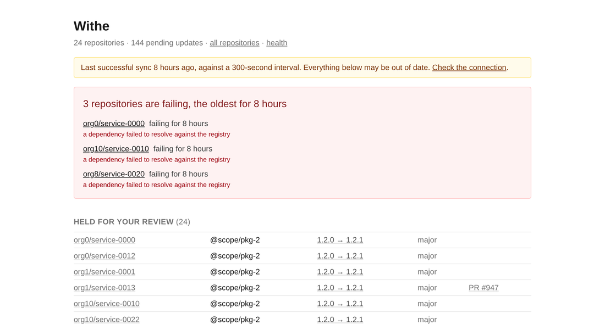

# Withe

**A dashboard for the Renovate you already run — no operator, no migration, nothing to replace.**

You point it at a Renovate installation that is already working. It reads. It changes nothing.

## The problem

Renovate tells you what it did, one repository at a time. A run that failed three days ago on one of
forty repositories looks exactly like a run that did not happen. Finding it means reading container
logs or opening forty Dependency Dashboard issues.

Withe answers, on one page: **which repositories are broken, and since when.**

## What Withe shows

- **Preflight.** Renovate CE ships its API switched off. Withe names the exact variables that are
  missing and gives you a block to paste into your Compose file.
- **Repository inventory.** Every organization and repository Renovate knows about, with its state
  and last run.
- **Failure triage.** The landing page — repositories with failing runs, ordered by how long they
  have been failing, with the error attached.
- **Run history.** Every run for a repository: when it queued, when it started, how long it took,
  and how it ended.
- **Log viewer.** The full JSON-Lines log for any run, read through Renovate's documented endpoint —
  never scraped off a container.

## What this is not

Every item is a permanent exclusion, not a feature that is coming.

- Withe does not run Renovate. It observes one that is already running.
- It does not schedule runs, edit configuration, merge pull requests, or trigger runs.
- It has no user accounts, roles, or permissions. Optional HTTP basic authentication is the whole of
  it.

Withe is read-only against Renovate by design.

## Next

- [Installation](installation.md) — one container and one volume.
- [Exposure & TLS](exposure.md) — keep it off the open internet.
- [Configuration](configuration.md) — every environment variable.
